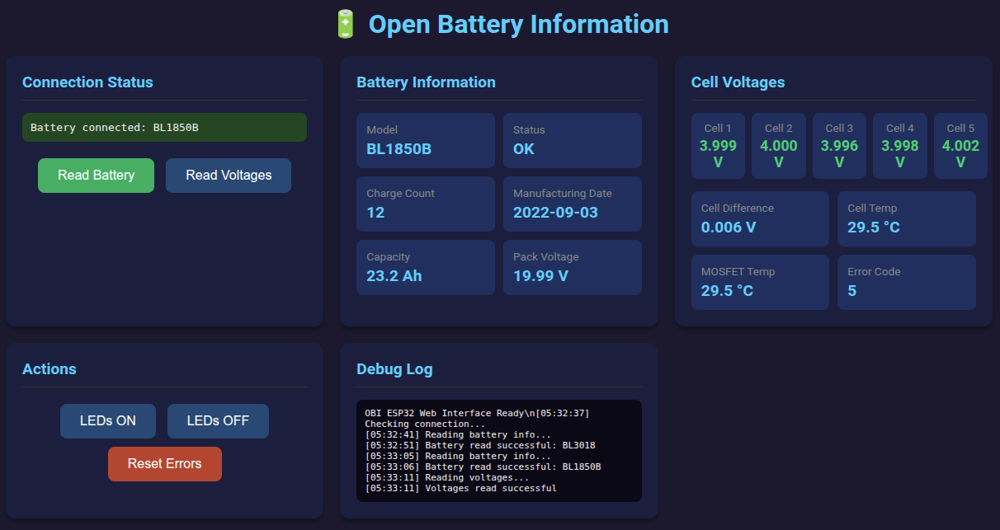
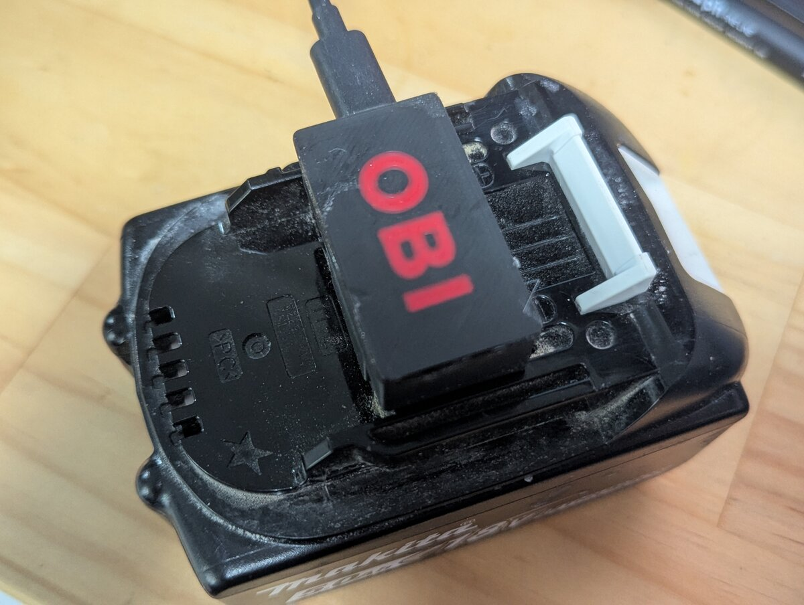
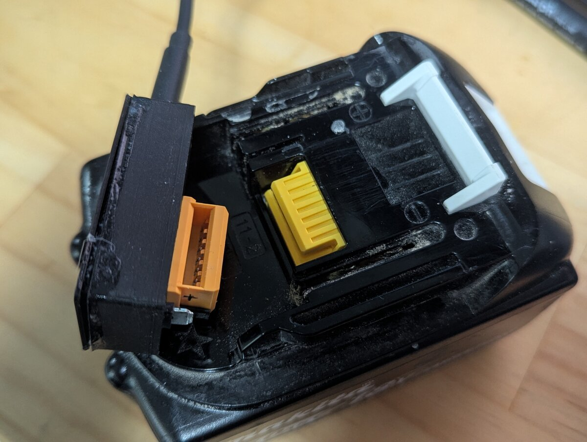
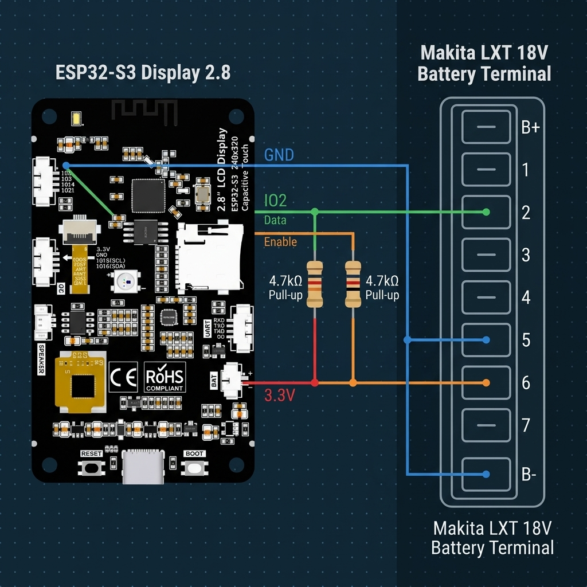
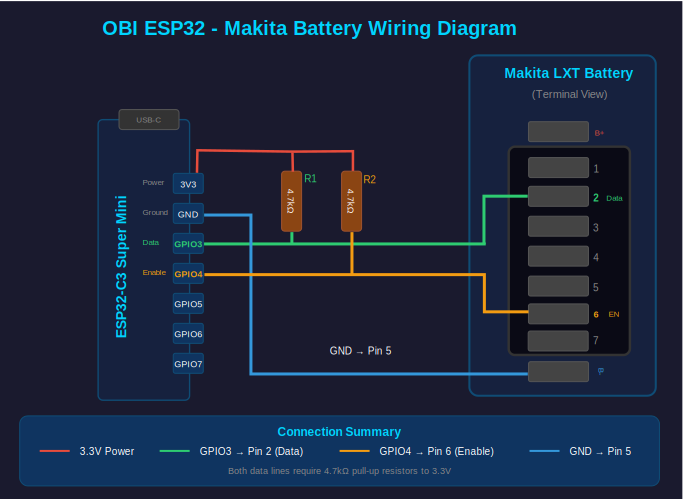

# OBI ESP32 - Thông tin Pin Mở (Open Battery Information)

Phiên bản chuyển hệ (port) sang ESP32-C3 và ESP32-S3 của dự án gốc [Open Battery Information](https://github.com/mnh-jansson/open-battery-information) bởi Martin Jansson.

Firmware này cung cấp một giao diện web hoặc giao diện màn hình TFT 2.8" độc lập để đọc thông tin pin Makita LXT (18V), bao gồm điện áp từng cell, nhiệt độ, số chu kỳ sạc và mã lỗi.



## Tính năng

- **Giao diện Web**: Ứng dụng một trang (SPA) phản hồi nhanh, có thể truy cập từ bất kỳ trình duyệt nào (dành cho cả ESP32-C3 và ESP32-S3).
- **Màn hình TFT 2.8" Độc lập**: Đọc trực tiếp thông tin pin, điện áp từng cell, nhiệt độ và lỗi ngay trên màn hình với các nút bấm cảm ứng dung kháng (dành riêng cho phiên bản ESP32-S3 Display).
- **Dữ liệu Pin Thời gian thực**: Cập nhật điện áp pack pin, điện áp từng cell, nhiệt độ và số chu kỳ sạc theo thời gian thực (1 giây/lần).
- **Khám phá mDNS**: Truy cập dễ dàng qua địa chỉ `http://obi-esp32.local`.
- **Cập nhật OTA**: Nâng cấp firmware không dây (WiFi) sau lần nạp đầu tiên qua cổng USB.
- **REST API**: Các endpoint dạng JSON tiện lợi để tích hợp với các hệ thống nhà thông minh khác.
- **Cảm biến nhiệt độ kép**: Đọc cảm biến nhiệt độ Cell pin và nhiệt độ MOSFET.

---

## Yêu cầu phần cứng

### Danh sách linh kiện (BOM)

| Linh kiện | Số lượng | Ghi chú |
|-----------|----------|---------|
| Mạch ESP32-C3 Super Mini **HOẶC** ESP32-S3 Display 2.8" | 1 | Dùng ESP32-C3 cho chế độ chỉ chạy giao diện Web; Dùng ESP32-S3 2.8" TFT Display (ví dụ board CYD ESP32-2432S028R/C) cho giao diện cảm ứng độc lập. |
| Điện trở 4.7kΩ | 2 | Điện trở kéo lên (Pull-up) cho các đường truyền dữ liệu OneWire. |
| Pin Makita LXT | 1 | Dòng pin 18V của Makita (BL18xx series). |
| Dây nối | 4 | Để kết nối từ mạch điều khiển tới pin. |
| Jack kết nối đế sạc Makita | 1 | Đầu cắm lấy tín hiệu từ pin (có thể mua trên AliExpress). |

### Vỏ hộp (Enclosure)

Bạn có thể in 3D vỏ hộp được thiết kế cho phiên bản OBI chạy Arduino gốc, nó hoàn toàn vừa vặn với phiên bản ESP32 này:

- **Vỏ hộp chính**: [Makita 18V Battery Unlock Device (OBI)](https://makerworld.com/en/models/2087559-makita-18v-battery-unlock-device-obi#profileId-2256293) trên MakerWorld.
- **Khay giữ ESP32**: [ESP32-C3 Super Mini holder](https://cad.onshape.com/documents/c5aa6404e5114fbe73d30d6f/w/0a86b12236fd063c60bf388b/e/192fc2f6005dd903a32d98f6) - khay đệm nhỏ giúp cố định ESP32-C3 Super Mini vào đúng vị trí của Arduino Nano cũ.





---

## Sơ đồ đấu dây (Wiring Diagram)

### 1. Sơ đồ đấu dây cho ESP32-S3 Dev Board (Không có chip nạp CH340 / Kết nối USB trực tiếp)

Dưới đây là sơ đồ đấu nối chi tiết sử dụng mạch **ESP32-S3**:



### 2. Sơ đồ đấu dây cho ESP32-C3 / Sơ đồ nguyên lý chung



### Kết nối chân chi tiết (Pin Connections)

Tùy thuộc vào loại mạch bạn sử dụng, hãy kết nối các chân của pin Makita tới các chân GPIO tương ứng:

#### Phiên bản mạch ESP32-C3 (Chỉ Web)
| Chân ESP32-C3 | Chân Pin Makita | Mô tả |
|--------------|----------------|-------------|
| GPIO3 | Chân 2 (Data) | Đường truyền dữ liệu OneWire |
| GPIO4 | Chân 6 (Enable) | Tín hiệu kích hoạt (Enable) |
| GND | Chân 5 (B-) | Chân đất chung (GND) |
| 3.3V | — | Cấp nguồn cho điện trở kéo lên |

#### Phiên bản mạch ESP32-S3 Display 2.8"
| Chân ESP32-S3 | Chân Pin Makita | Mô tả |
|--------------|----------------|-------------|
| GPIO2 | Chân 2 (Data) | Đường truyền dữ liệu OneWire |
| GPIO3 | Chân 6 (Enable) | Tín hiệu kích hoạt (Enable) |
| GND | Chân 5 (B-) | Chân đất chung (GND) |
| 3.3V | — | Cấp nguồn cho điện trở kéo lên |

*Lưu ý: Đối với board ESP32-S3 Display, các chân điều khiển màn hình TFT (ILI9341) và cảm ứng (FT6336) đã được đấu dây sẵn bên trong mạch. Bạn chỉ cần hàn dây kết nối pin Makita vào các chân mở rộng bên ngoài của mạch.*

### Điện trở kéo lên (Pull-up Resistors)

- **Với ESP32-C3**: Cả hai chân GPIO3 và GPIO4 đều yêu cầu điện trở kéo lên 4.7kΩ nối vào nguồn 3.3V.
- **Với ESP32-S3**: Cả hai chân GPIO2 và GPIO3 đều yêu cầu điện trở kéo lên 4.7kΩ nối vào nguồn 3.3V.
*Đây là yêu cầu bắt buộc để giao thức truyền nhận OneWire tùy biến hoạt động chính xác.*

### Sơ đồ chân cắm trên Pin Makita LXT

Nhìn trực diện vào cụm giắc cắm trên pin Makita:

```
┌───────────────────────────────────────────┐
│     [1]  [2]  [3]  [4]  [5]  [6]  [7]     │
│  B+      DATA                EN        B- │
└───────────────────────────────────────────┘
```

- **Chân ngoài cùng bên trái (B+)**: Điện áp dương của pack pin (18V) - **KHÔNG ĐƯỢC KẾT NỐI** vào ESP32.
- **Chân số 2 (Data)**: Giao tiếp OneWire.
- **Chân số 6 (EN)**: Tín hiệu kích hoạt (nằm ở cạnh bên).
- **Chân ngoài cùng bên phải (B-)**: Chân âm chung (Ground).

⚠️ **Cảnh báo cực kỳ nguy hiểm**: Không bao giờ được kết nối chân B+ (18V) trực tiếp vào bất kỳ chân nào của ESP32. Điện áp 18V của pin sẽ phá hủy mạch điều khiển ngay lập tức.

---

## Hướng dẫn Biên dịch và Nạp Firmware

### Yêu cầu trước khi cài đặt

- [PlatformIO](https://platformio.org/) (Cài đặt làm Extension trên VS Code hoặc dùng CLI).
- Cáp kết nối USB-C.

### Cấu hình Wi-Fi

Sao chép file cấu hình mẫu và điền thông tin mạng Wi-Fi của bạn:

```bash
cp src/secrets.h.example src/secrets.h
```

Chỉnh sửa file `src/secrets.h` bằng thông tin mạng Wi-Fi nhà bạn:

```cpp
#define WIFI_SSID "Tên_WiFi_Của_Bạn"
#define WIFI_PASS "Mật_Khẩu_WiFi_Của_Bạn"
```

*File `secrets.h` đã được đưa vào danh sách `.gitignore` nên thông tin Wi-Fi của bạn sẽ không bị đẩy lên GitHub công khai.*

### Nạp lần đầu (Qua cổng USB)

Chọn môi trường build phù hợp với phần cứng bạn sử dụng:

#### 1. Cho ESP32-C3 (Chỉ chế độ Web):
```bash
# Build và upload firmware qua USB
pio run -e esp32c3_web -t upload

# Theo dõi cổng Serial Monitor
pio device monitor
```

#### 2. Cho ESP32-S3 Display 2.8":
```bash
# Build và upload firmware qua USB
pio run -e esp32s3_display -t upload

# Theo dõi cổng Serial Monitor
pio device monitor
```

### Cập nhật không dây (OTA)

Sau lần nạp đầu tiên qua USB, bạn có thể cập nhật firmware từ xa thông qua mạng Wi-Fi (cập nhật địa chỉ IP của ESP32 vào file `platformio.ini` tương ứng trước khi chạy):

```bash
# Cho ESP32-C3
pio run -e esp32c3_ota -t upload

# Cho ESP32-S3
pio run -e esp32s3_ota -t upload
```

---

## Cách sử dụng

### 1. Truy cập thiết bị

ESP32 hỗ trợ quảng bá mDNS. Sau khi thiết bị kết nối thành công vào Wi-Fi nhà bạn, hãy truy cập qua trình duyệt:

- **Đường dẫn mDNS**: `http://obi-esp32.local`
- **Địa chỉ IP trực tiếp**: Xem địa chỉ IP được in ra trên cổng Serial Monitor lúc khởi động.

### 2. Giao diện Web

Giao diện Web cung cấp:
- **Trạng thái kết nối**: Cho biết pin đang cắm hay đã rút.
- **Thông tin Pin**: Hiển thị Model, Số chu kỳ sạc, Ngày sản xuất, Dung lượng thiết kế.
- **Điện áp Cell**: Điện áp chi tiết của từng cell pin với mã màu cảnh báo sức khỏe cell:
  - Xanh lá (≥3.5V): Tốt.
  - Vàng (3.0V - 3.5V): Cảnh báo yếu.
  - Đỏ (<3.0V): Nguy hiểm / Cần sạc lại ngay.
- **Nhiệt độ**: Đọc nhiệt độ cảm biến Cell pin và cảm biến MOSFET.
- **Mã lỗi (BMS)**: Trạng thái lỗi báo từ pin.
- **Hành động nhanh**: Test nháy đèn LED báo pin và chức năng xóa lỗi pin (Reset Error).
- **Log Debug**: Nhật ký hoạt động chi tiết thời gian thực.

### 3. Các API Endpoints tích hợp

#### `GET /api/read`
Trả về toàn bộ thông tin pin chi tiết dưới dạng JSON:
```json
{
  "success": true,
  "model": "BL1850B",
  "locked": false,
  "chargeCount": 42,
  "mfgDate": "2021-06-15",
  "capacity": 5.0,
  "errorCode": 6,
  "packVoltage": 16.52,
  "cell1": 3.304,
  "cell2": 3.305,
  "cell3": 3.303,
  "cell4": 3.304,
  "cell5": 3.304,
  "cellDiff": 0.002,
  "tempCell": 29.5,
  "tempMosfet": 28.2
}
```

#### `GET /api/voltages`
Chỉ trả về thông số điện áp và nhiệt độ để tối ưu hóa tốc độ đọc:
```json
{
  "success": true,
  "packVoltage": 16.52,
  "cell1": 3.304,
  "cell2": 3.305,
  "cell3": 3.303,
  "cell4": 3.304,
  "cell5": 3.304,
  "cellDiff": 0.002,
  "tempCell": 29.5,
  "tempMosfet": 28.2
}
```

#### `GET /api/leds?state=1|0`
Điều khiển bật/tắt các đèn LED chỉ thị trên pin (nếu pin hỗ trợ).

#### `GET /api/reset`
Xóa các mã lỗi đã lưu trên chip BMS của pin. Hãy cẩn trọng khi dùng.

---

## Danh sách mã lỗi BMS thường gặp

Dựa trên quá trình thử nghiệm thực tế, các mã lỗi sau đã được ghi nhận:

| Mã lỗi | Ý nghĩa |
|------|---------|
| 4 | Lỗi phần cứng/Khóa pin (Bảo vệ xả quá mức/Hỏng cell) |
| 6 | Pin hoạt động bình thường |

*Lưu ý: Tài liệu giải mã lỗi chính thức của Makita không được công bố công khai, các thông tin trên là do cộng đồng tự kiểm tra và rút ra.*

---

## Bản quyền và Lời cảm ơn

Dự án này là phiên bản port của mã nguồn [Open Battery Information](https://github.com/mnh-jansson/open-battery-information) gốc của Martin Jansson.

Tài liệu tham khảo thêm:
- [Video hướng dẫn làm OBI](https://www.youtube.com/watch?v=kUg9jWvf5FM) - Hướng dẫn chi tiết cách build phiên bản Arduino Nano.
- [Vỏ hộp in 3D](https://makerworld.com/en/models/2087559-makita-18v-battery-unlock-device-obi) - Thiết kế vỏ in 3D tiện lợi.

Dự án phát hành dưới giấy phép **MIT License** - xem chi tiết tại file [LICENSE](LICENSE).
